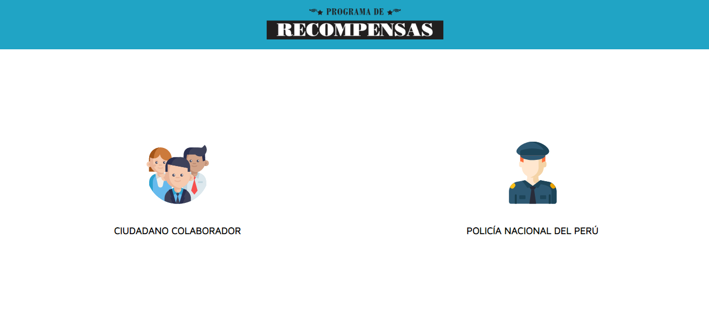
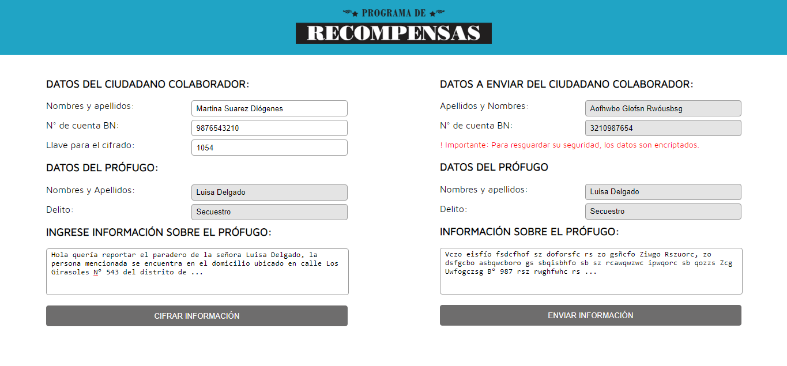
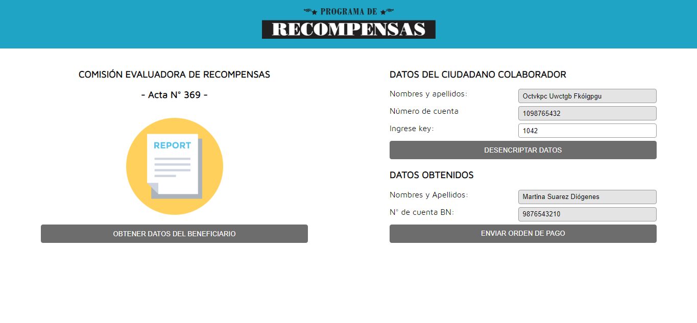

# Programa de Recompensas

## Antecedentes

Debido a que el Ministerio del Interior ha publicado la lista de prófugos y a su vez un número de contacto para quienes quieren brindar información que ayude a la ubicación captura de estos prófugos, y como recompensa de ello se le realiza un pago. Hasta el momento la única forma de realizar una denuncia es por medio de una llamada y por lo mismo esto hace que quien recepciona la información tiene acceso libre a los datos del ciudadado colaborador y lo mismo al momento de hacer efectivo el pago de la recompensa.

Hay denuncias de ambos lados, ya que hubieron personas que suplantaron la identidad del ciudadano colaborador para luego cobrar la recompensa, así como también hubo casos donde la policía(malos efectivos policiales) haciendo uso de la información al que tenían acceso extorsionaban al ciudadano colaborador.

## Sobre el proyecto

Este proyecto consiste en cifrar información confidencial, donde a ello solo tendrán acceso personas autorizadas y que cuenten con una llave(Número) para desencriptar la información recibida. Resguardando así los datos del ciudadano colaborador. Este proyecto fue realizado con HTML5, CSS3, VanillaJS, y Balsamiq como herramienta de prototipado.

## Imágenes del proyecto

## Investigación UX

### ¿Quiénes son los usuarios y los objetivos en relación con el producto?

El usuario es la policía, quienes se encargan de recepcionar las denuncias realizadas por cuidadanos que proporcionan información respecto al paradero de un prófugo.

### ¿Cómo el producto soluciona los problemas/necesidades de dichos usuarios?

Cada cuidadano que proporciona información sobre el paradero de algún prófugo corre el riesgo de que alguien más se entere de su colaboración, estos datos del ciudadano colaborador (nombres, apellidos y número de cuenta bancaria) son recepcionados pero estos encriptados, excepto la información que proporciona sobre el prófugo, dando así lugar a que la policía realice las investigaciones pertinentes, y en caso la información haya sido relevante para la captura, estos datos pasan a la Comisión Evaluadora de Recompensas, quienes a través de un acta solicitan el pago al ciudadano colaborador, y la información es devuelta a la policía, más no el detalle del motivo del pago de recompensa.

### Foto del primer prototipo en papel

### Resumen del feedback recibido y las mejoras a realizar

Inicialmente no tenía muy claro las vistas, por lo que hice varias y al pedir feedback como que descarté algunas, quité campos que eran poco relevantes y añadí otros en base a las sugerencias y observaciones que obtuve.

### Imagen del prototipo final
  
  
  
  
  
    
## Objetivos de aprendizaje del proyecto

### UX

- [ ] Diseñar la aplicación pensando y entendiendo al usuario.
- [x] Crear prototipos para obtener feedback e iterar.
- [x] Aplicar los principios de diseño visual (contraste, alineación, jerarquía).

### HTML y CSS

- [x] Uso correcto de HTML semántico.
- [x] Uso de selectores de CSS.
- [x] Construir tu aplicación respetando el diseño realizado (maquetación).

### DOM

- [x] Uso de selectores del DOM.
- [x] Manejo de eventos del DOM.
- [x] Manipulación dinámica del DOM.

### Javascript

- [x] Manipulación de strings.
- [x] Uso de condicionales (if-else | switch).
- [x] Uso de bucles (for | do-while).	
- [x] Uso de funciones (parámetros | argumentos | valor de retorno).
- [x] Declaración correcta de variables (const & let).

### Testing

- [x] Testeo de tus funciones.

### Git y GitHub

- [x] Comandos de git (add | commit | pull | status | push).
- [x] Manejo de repositorios de GitHub (clone | fork | gh-pages).

### Buenas prácticas de desarrollo

- [x] Uso de identificadores descriptivos (Nomenclatura | Semántica).
- [x] Uso de linter para seguir buenas prácticas (ESLINT).
